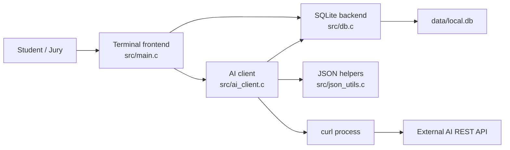

# Architecture

MemoCoach AI is organized as a desktop/CLI product with a clear split between frontend interaction and backend logic.



## Modules

| Module | Responsibility |
|---|---|
| `src/main.c` | Command parsing, terminal output, frontend workflow |
| `src/db.c` | SQLite connection, schema creation, notes, stored AI results |
| `src/ai_client.c` | AI request construction, curl execution, mock fallback |
| `src/json_utils.c` | JSON escaping and assistant content extraction |
| `src/util.c` | File, directory, environment, and time helpers |

## Data Flow

1. The user adds a study note through the terminal frontend.
2. The database module stores the note in SQLite.
3. The user requests a summary or quiz for a note ID.
4. The AI client builds a JSON payload and calls an external REST API through `curl`.
5. The JSON helper extracts the assistant message content.
6. The database module stores the AI output for auditability and later review.

## Database Schema

```sql
CREATE TABLE notes (
    id INTEGER PRIMARY KEY AUTOINCREMENT,
    title TEXT NOT NULL,
    course TEXT NOT NULL,
    content TEXT NOT NULL,
    created_at TEXT NOT NULL
);

CREATE TABLE ai_results (
    id INTEGER PRIMARY KEY AUTOINCREMENT,
    note_id INTEGER NOT NULL,
    task TEXT NOT NULL,
    provider TEXT NOT NULL,
    result TEXT NOT NULL,
    created_at TEXT NOT NULL,
    FOREIGN KEY(note_id) REFERENCES notes(id) ON DELETE CASCADE
);
```

## Error Handling

- Database errors are returned to the CLI and printed with a clear prefix.
- Missing AI credentials automatically trigger mock mode unless mock mode is explicitly disabled by a future extension.
- Non-2xx API responses are reported with the HTTP status and a shortened provider body.
- API calls have a curl timeout of 25 seconds.

## Security

- API keys are read from environment variables.
- `.env` is ignored by Git.
- The temporary API request JSON file is removed after each live request.

